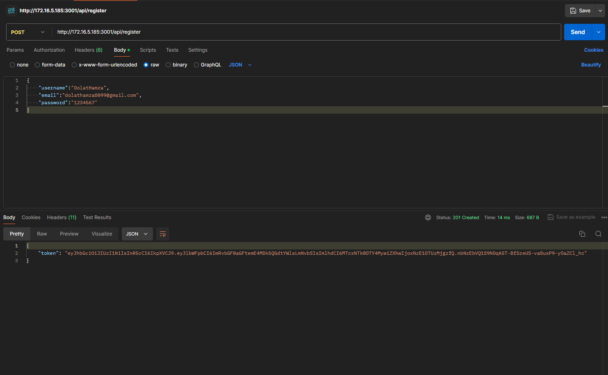
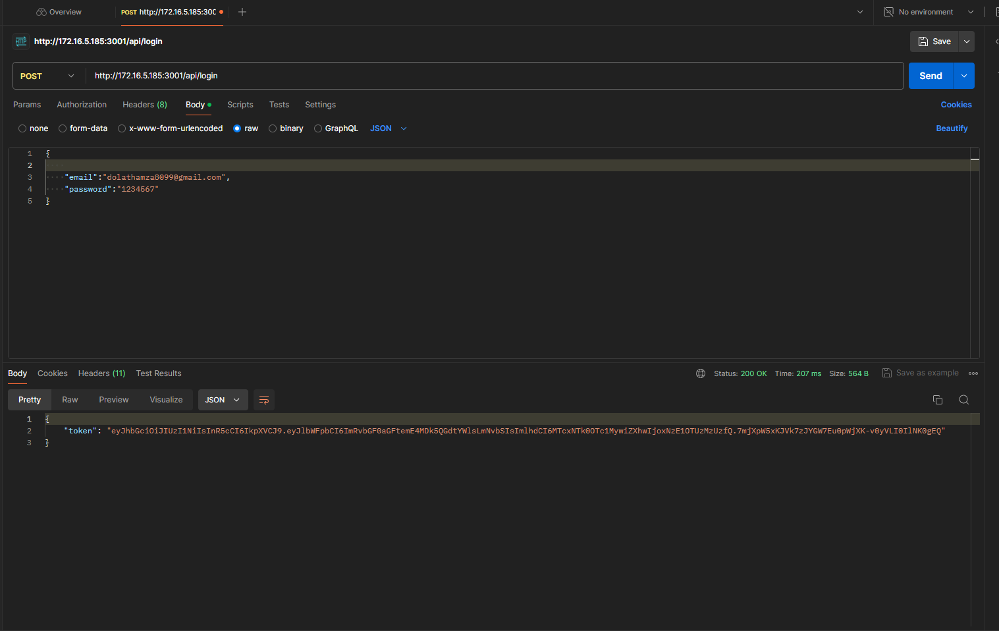

# API Documentation

This document provides an overview of the Register, Login, and Checkout APIs, along with their corresponding Postman screenshots and example responses.

## Register API

**Postman Screenshot:**



**Description:**

This API endpoint is used to register a new user. It requires the user to provide their name, email address, and password. Upon successful registration, the server typically responds with a confirmation message or a token for authentication.

## Login API

**Postman Screenshot:**

[Image of Login API Postman Screenshot]

**Description:**

The Login API enables existing users to authenticate themselves by providing their email address and password. If the credentials are valid, the server usually returns an authentication token, which is used to authorize subsequent requests.

## Checkout API


**Response:**

```json
{
  "message": "Checkout successful"
}
```

**Description:**

The Checkout API is designed to process a customer's order and complete the purchase. The provided JSON response indicates a successful checkout operation.

**Note:** The detailed request body for the Checkout API (e.g., cart details, customer information) was omitted from the original request. For complete documentation, please include the request body structure and any additional response codes or error messages.

## Additional Information

* **Base URL:** `http://localhost:3001/api/` _(This might be different for your setup)_
* **Authentication:** The Checkout API appears to require a Bearer token for authorization.
* **Error Handling:** Ensure you document how the APIs handle errors and provide appropriate status codes and messages to the client.

